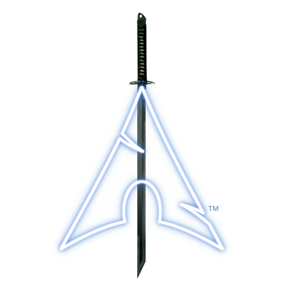
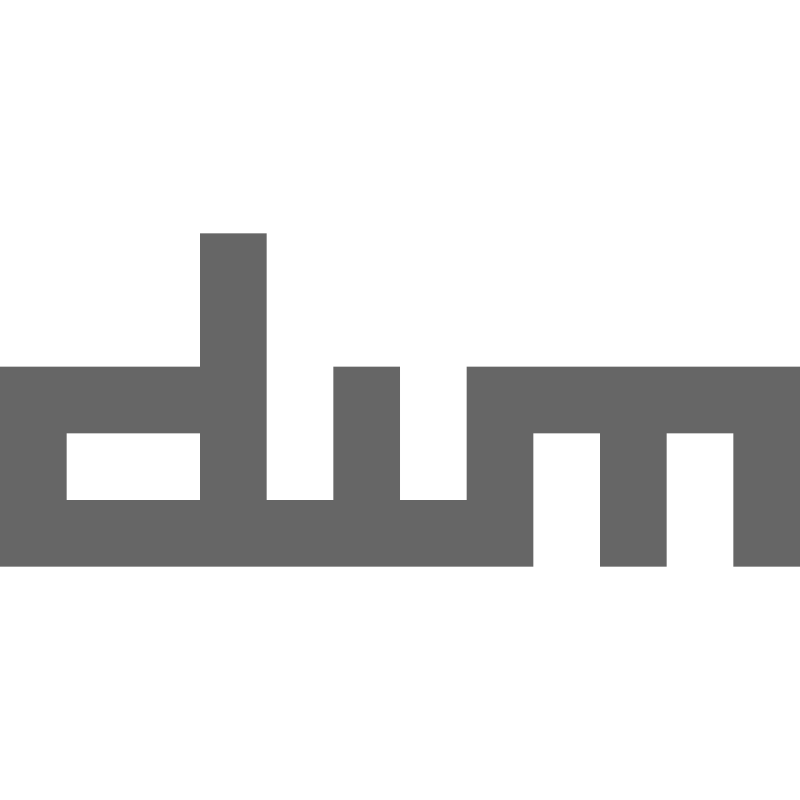

  

  
  
  
  
  
  
  

### About me
- Very passionate Cybersecurity Engineer and Penetration Tester :computer:
- Linux enthusiast and use Arch and Blackarch as my OSes :alien:
- Currently doing my Masters in Cybersecurity on static malware analysis :space_invader:
- Love playing CTFs in my free time :mount_fuji: 

  
   

<table style="width: 100%;">
<tr>
<th> ### Technologies in my environment: </th>
<th> ### Tools i use: </th>
</tr>
<tr>
<td>

  
  
  
  

</td>
<td>

  
  
  

</td>
</tr>
</table>

### Languages:

  
  
  
  
  
  
  
  

